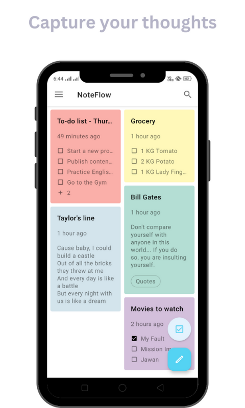

### Design breakdown

| Element | Detail |
|---|---|
| Background | Soft sage green `#D6E8D0` |
| App icon | Shopping cart emoji, centered, large |
| App title | **घर की किराना लिस्ट** — dark forest green, bold, large (~40px) |
| Tagline | आवाज़ से सामान जोड़ें — आसान और तेज़ — muted green, regular weight |
| Login card | White rounded card, large radius (~24px), soft shadow |
| Card heading | 👋 अपने Gmail से लॉगिन करें — bold |
| Google button | White pill button, Google logo left, "Sign in with Google" text, blue border |
| Privacy note | Light green rounded box — 🔒 आपकी जानकारी सुरक्षित है। सिर्फ नाम और प्रोफाइल फोटो उपयोग होगी। |
| Footer text | Muted grey — लॉगिन करने के बाद आपकी किराना लिस्ट इसी डिवाइस पर सेव रहेगी। |

### Color palette
| Token | Value | Use |
|---|---|---|
| Page background | `#D6E8D0` | Sage green full-bleed |
| App title | `#2D5A1B` | Dark forest green |
| Tagline | `#5A8A4A` | Medium green |
| Card background | `#FFFFFF` | White login card |
| Google button border | `#4285F4` | Google blue |
| Privacy box bg | `#E8F5E3` | Light mint |
| Footer text | `#9D9896` | Muted grey |

### Key UX notes
- No "skip login" button visible on this screen — login is the primary CTA
- Privacy assurance shown prominently — important for elderly users who may distrust apps
- Single focused action per screen — no clutter
- All text in Hindi — no English except "Sign in with Google"

---

## Screen 2 — App Screen (Grocery Card Grid)

This screenshot is the primary visual reference for the किराना लिस्ट app design for the main grocery list screen.

---

## Key design elements to replicate

### Layout
- 2-column card grid (masonry-style, cards vary in height)
- Cards are the primary content unit — no tables
- FAB (floating action button) fixed at bottom-right — cyan/teal color
- Clean top bar with app name and search icon

### Cards
- Rounded corners (`border-radius` ~16px)
- Pastel background colors — each card a different color:
  - Coral/pink (To-do list)
  - Yellow (Grocery)
  - Lavender/light blue (Taylor's line)
  - Teal/mint (Bill Gates)
  - Purple/mauve (Movies to watch)
- Card title in bold, dark text
- Timestamp in muted grey below title
- Checkbox items inside cards with square checkboxes
- Soft shadows, no harsh borders

### Typography
- App title: medium weight, clean sans-serif
- Card titles: bold, ~16px
- Card content: regular, ~13–14px
- Timestamps: muted grey, small

### Color palette (inferred)
| Element | Color |
|---|---|
| Background | Off-white / light grey |
| Coral card | `#F7CECA` |
| Yellow card | `#F5F0CE` |
| Mint/teal card | `#CEEAE5` |
| Mauve card | `#EAD5E8` |
| Sky/blue card | `#D5E3F5` |
| FAB button | Cyan `#4DD0E1` |
| Card text | Dark charcoal `#3D3A38` |
| Timestamps | Muted grey `#9D9896` |

### FAB button
- Circular, fixed bottom-right
- Cyan/teal color with white icon
- Used for primary action (add / voice input)

---

## Adaptations for किराना लिस्ट

| NoteFlow | किराना लिस्ट |
|---|---|
| Multiple note types per card | Each card = one grocery item |
| Square checkboxes | Circle checkboxes |
| Pencil FAB (edit) | Mic FAB (voice input) |
| English UI | Hindi UI |
| Generic cards | Cards show: item name, qty · brand, date |
